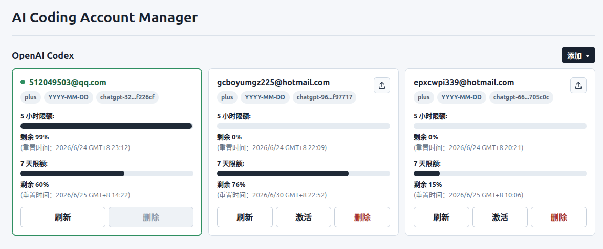

# AI Coding Account Manager

本项目是一个本地运行的 AI coding 工具多账号管理器。当前主要面向 OpenAI
Codex 账号，提供浏览器管理页面，用于添加账号、导入凭据、查看额度、刷新状态、
切换活动账号和删除非活动账号。

服务默认只监听本机 loopback 地址，不设计为公网、局域网或多用户系统。SQLite 只保存
账号元数据和 usage snapshot；Codex `auth.json` 保存在账号隔离凭据目录中，不写入
数据库、浏览器持久化存储或 API 响应。



> [!IMPORTANT]
> 本项目面向本地单实例运行。一个应用实例应独占自己的 SQLite `state.db`、
> `credentialsDir` 和 `codexHome`，不要让多个应用实例共享同一个 SQLite 文件，也不要
> 将 SQLite 文件放在 NFS 等网络文件系统上。多实例部署需要 PostgreSQL 等共享数据库
> 以及 operation ownership、lease、heartbeat 和任务协调机制，当前版本不支持。

## 功能概览

- 本地 Web 管理页，无需单独前端 dev server。
- 支持 Codex browser 登录添加、手动录入、导入 `auth.json`。
- 支持刷新账号额度、设置套餐到期日、激活账号和删除非活动账号。
- 每个账号使用独立凭据目录，激活时才替换当前 `CODEX_HOME/auth.json`。
- 提供 SQLite 持久化、SQL migration、统一 API response envelope 和请求安全校验。
- 内置 fake provider，便于不使用真实 Codex 账号时验收前端交互。
- 提供本地统一脚本；保留 Dockerfile 和 `compose.yaml` 作为可选托管运行方式。

仍需在真实 Codex 账号环境中做发布前验收；自动化测试不能替代真实账号登录、额度刷新
和 IDE reload 验收。

## 开发环境

项目使用 `mise` 固定 Go 工具链版本。安装并启用 `mise` 后，在项目目录执行：

```bash
mise install
go version
```

`mise.toml` 会自动选择项目需要的 Go 版本。不建议依赖 Homebrew 全局 Go 版本；项目内以
`mise` 激活的 Go 为准。

## 快速开始

默认监听地址是 `127.0.0.1:43127`。

使用统一脚本启动本地完整应用：

```bash
./scripts/local.sh start
```

查看日志：

```bash
./scripts/local.sh logs --follow
```

后台启动时日志追加写入 `logs/server.log`，并按自然日轮转为
`logs/server-YYYY-MM-DD.log`；每个 HTTP 响应都会返回 `X-Trace-ID`，对应日志字段为
`trace_id`。

服务启动后，用浏览器打开日志中的本地 URL 即可使用。

停止服务：

```bash
./scripts/local.sh stop
```

如果只需要验收前端交互，可使用 fake provider：

```bash
./scripts/local.sh fake
```

开发调试时也可以前台运行，便于直接查看日志和中断进程：

```bash
./scripts/local.sh start --foreground
```

也可以直接运行 Go server：

```bash
go run ./cmd/ai-coding-account-manager
```

指定 fake 配置：

```bash
go run ./cmd/ai-coding-account-manager --config config/app.fake.json
```

## Docker 托管（可选）

默认本地开发不需要 Docker。如果希望交给外部 supervisor 托管生命周期，可以使用
Docker Compose。Docker 默认也只发布到宿主机 loopback 地址：

```bash
docker compose up --build
```

默认使用 named volume 保存 `/data` 和 `/codex`。如需复用宿主机 Codex 登录态，可以将
`compose.yaml` 中的 `codex-home` volume 改为只限本机使用的 bind mount，例如
`~/.codex:/codex`。

Compose 同样只支持单副本运行；不要对当前服务执行多副本扩容，也不要让多个容器共享
同一份 SQLite `/data/state.db` 和 Codex 凭据目录。

不要把真实 `auth.json` 放入 build context 或镜像 layer。

## 配置

配置读取顺序：内置默认值、`config/app.json`。可参考
`config/app.example.json` 创建本地配置。

| 字段 | 默认值 | 说明 |
| --- | --- | --- |
| `bindAddr` | `127.0.0.1:43127` | HTTP 监听地址，允许 `127.0.0.1`、`localhost` 或 `0.0.0.0`；请求 Host 仍只接受本机地址 |
| `dataDir` | `.data` | SQLite 和登录任务运行数据目录 |
| `credentialsDir` | `.credentials` | 账号隔离凭据目录 |
| `codexBin` | 空 | Codex CLI 可执行文件路径；空值时自动发现 |
| `codexHome` | `CODEX_HOME` 或 `~/.codex` | 活动 Codex 凭据目录；配置文件优先于 `CODEX_HOME` |
| `providerMode` | 空 | 设为 `fake` 时使用 fake provider |

除 `CODEX_HOME` 作为外部工具约定的 fallback 外，项目不再使用
`AI_CODING_ACCOUNT_MANAGER_*` 环境变量作为正式配置入口。

## 使用说明

### 登录添加

管理页面的“登录添加”会创建隔离的临时 `CODEX_HOME`，引导用户完成官方 Codex 登录，
然后读取真实账号 email 和套餐信息，并把临时目录里的 `auth.json` 导入到该账号的
隔离凭据目录。

如果浏览器当前已登录其他 OpenAI/Codex 账号，官方登录页可能直接使用该账号。需要在
官方页面切换到目标账号，或使用无痕窗口。

登录添加不会替换当前活动 `CODEX_HOME/auth.json`；只有点击“激活”才会切换活动账号。

### 导入 auth.json

管理页面的“添加 -> 导入 auth.json”会先在临时 Codex 运行目录中识别账号并刷新 usage，
成功后才写入账号数据库记录、最近 usage snapshot 和账号隔离凭据目录。

如果账号识别或刷新失败，本次导入不会创建新的账号记录。不要把 `auth.json` 内容提交到
Git、日志、issue 或聊天记录。

### 刷新和激活

刷新账号时，后端会在临时 Codex 运行目录中读取账号和 rate limit 信息，并把刷新后的
`auth.json` 写回账号隔离目录。刷新不会修改当前活动账号。

点击“激活”会把对应账号隔离目录里的 `auth.json` 原子替换到配置的活动 `codexHome`
目录。已经运行中的 VS Code/Codex 进程可能仍持有旧 token，通常需要在 VS Code 中执行
`Developer: Reload Window`。

### 删除账号

只能删除非活动账号。删除会移除数据库中的账号记录，并清理对应账号隔离凭据目录。

## 数据目录

默认本地目录：

```text
config/app.json                                      本地配置，默认被 Git 忽略
.data/state.db                                      SQLite 数据库
.data/login-tasks/<task_id>/                        登录任务临时目录
.credentials/providers/codex/accounts/<account_id>/ 账号隔离凭据目录
.run/                                               本地脚本运行目录
```

备份时建议同时保存 `.data/state.db` 和 `.credentials/`。只备份数据库无法恢复真实 Codex
凭据；只备份凭据目录会丢失账号元数据、活动状态和 usage snapshot。

需要清理本地运行数据时，先停止服务，再按需删除 `.run/`、`.data/` 或 `.credentials/`。
删除 `.credentials/` 会移除所有已导入账号凭据。

## API

API 统一返回 `{data, code, message}` 结构。业务成功或失败通过响应体判断：

```json
{
  "data": {},
  "code": "SUCCESS",
  "message": "成功"
}
```

失败时：

```json
{
  "data": null,
  "code": "NOT_FOUND",
  "message": "接口不存在"
}
```

主要接口：

```text
GET    /api/health
GET    /api/providers
GET    /api/accounts
POST   /api/providers/{providerId}/accounts/create
POST   /api/providers/{providerId}/accounts/auth-json/import
POST   /api/providers/{providerId}/accounts/{accountId}/activate
POST   /api/providers/{providerId}/accounts/{accountId}/refresh
DELETE /api/providers/{providerId}/accounts/{accountId}
POST   /api/providers/{providerId}/login-tasks/create
GET    /api/providers/{providerId}/login-tasks/{taskId}
POST   /api/providers/{providerId}/login-tasks/{taskId}/cancel
```

所有写请求都需要同源 Origin。POST 请求需要 `Content-Type: application/json`。

## 项目结构

```text
cmd/ai-coding-account-manager/  进程入口
frontend/static/                前端静态资源
internal/app/                   配置加载、依赖装配、启动和关闭编排
internal/config/                启动配置读取和校验
internal/router/                Chi router、路由注册和 middleware 组装
internal/controller/            HTTP controller
internal/httpcontract/          HTTP API request/response contract
internal/service/               业务用例编排
internal/dao/                   持久化访问边界
internal/model/                 GORM 持久化模型
internal/infra/                 database、provider、credentials、app-server 实现
scripts/                        本地统一入口脚本
config/                         配置示例和 fake provider 配置
```

## 测试

常规测试：

```bash
go test ./...
```

如果本机 Go build cache 目录不可写，可以临时指定 `GOCACHE`：

```bash
GOCACHE=/tmp/ai-coding-account-manager-go-build go test ./...
```

发布前建议补充：

```bash
gofmt -l .
go vet ./...
go test -race ./...
CGO_ENABLED=0 go build ./cmd/ai-coding-account-manager
docker compose config
docker compose build
```

真实 Codex 验收至少覆盖：

- 登录添加账号后不修改原活动 `CODEX_HOME/auth.json`。
- 新账号可以刷新额度并显示 email、plan 和 reset time。
- 激活账号后，VS Code reload 后 Codex 使用目标账号。
- 删除非活动账号后，对应 `.credentials` 子目录被清理。
- `git status` 不出现凭据文件。

## 安全边界

- 不向局域网或公网暴露管理服务。
- 只接受配置端口上的 `127.0.0.1` 或 `localhost` Host。
- 写请求需要同源 Origin、`Content-Type: application/json`，并限制请求体大小。
- JSON 请求体使用 strict decode，拒绝未知字段、空 body、多个 JSON 值和超大 body。
- 不把 token 或完整 `auth.json` 写入数据库、项目文件、浏览器持久化存储或 API 响应。
- 日志和错误响应只能包含脱敏上下文，不能输出 token、refresh token 或完整
  `auth.json`。
